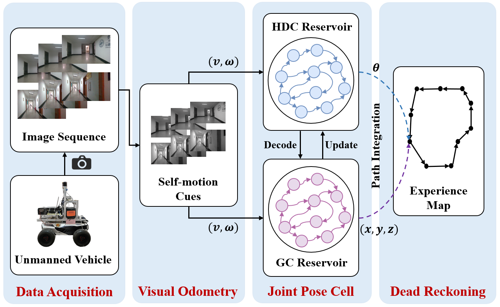
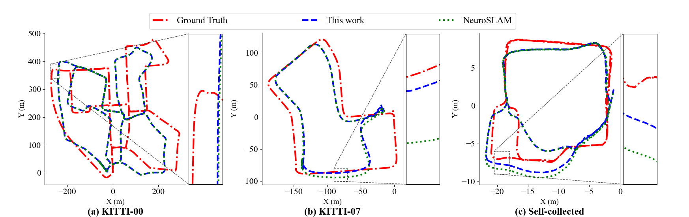
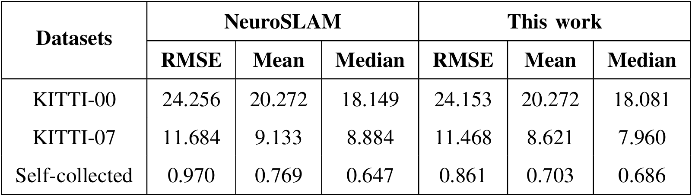
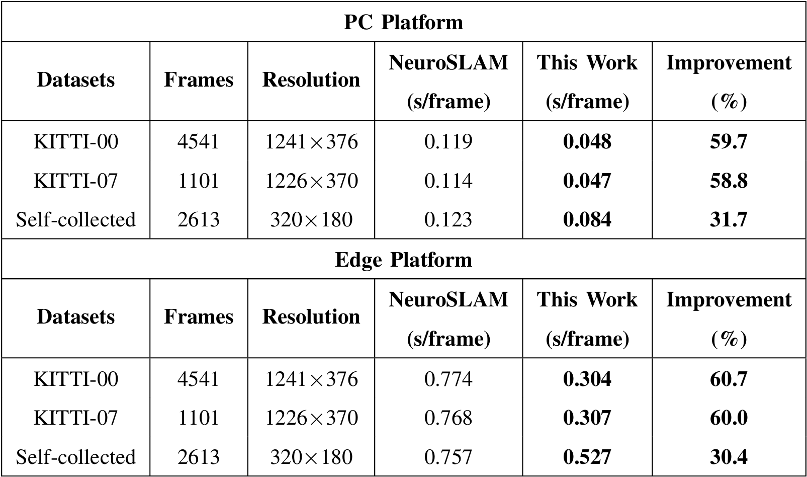

# Learning Attractor Dynamics via Reservoir Computing for Efficient and Robust Path Integration
The code for "Learning Attractor Dynamics via Reservoir Computing for Efficient and Robust Path Integration".



## Introduction
This repository contains the code for the paper "Learning Attractor Dynamics via Reservoir Computing for Efficient and Robust Path Integration". The code is organized into several modules, including data, model training, and inference. The main components of the code are as follows:

- `data/`: This directory contains the  data for training and testing the model.
- `model/`: This directory contains the implementation of the reservoir computing model, including the training and inference algorithms.
- `utils/`: This directory contains utility functions for data processing, model evaluation, and visualization.
- `main.py`: This is the main script for path integration, which includes the time cost evaluation and visualization of the results.
- `requirements.txt`: This file lists the required Python packages for running the code. It can be used to set up a virtual environment with the necessary dependencies.


## Usage
To run the code, follow these steps:

1. Clone the repository and navigate to the project directory.
2. Set up a virtual environment and install the required packages using the command:
   ```
   pip install -r requirements.txt
   ```
3. Run the main script to perform path integration and evaluate the time cost:
   ```
    python main.py
    ```
## Results
_Comparison of trajectories between NeuroSLAM and the proposed method on (a) KITTI-00, (b) KITTI-07, and (c) the self-collected dataset. The
trajectories are aligned with the ground truth using rigid transformations and uniform scaling to preserve topological consistency._



_Comparison of the ATE_



_Comparison of Average Processing Time per Frame on PC and Edge Platforms_




## License
This project is licensed under the Apache License. See the LICENSE file for details.